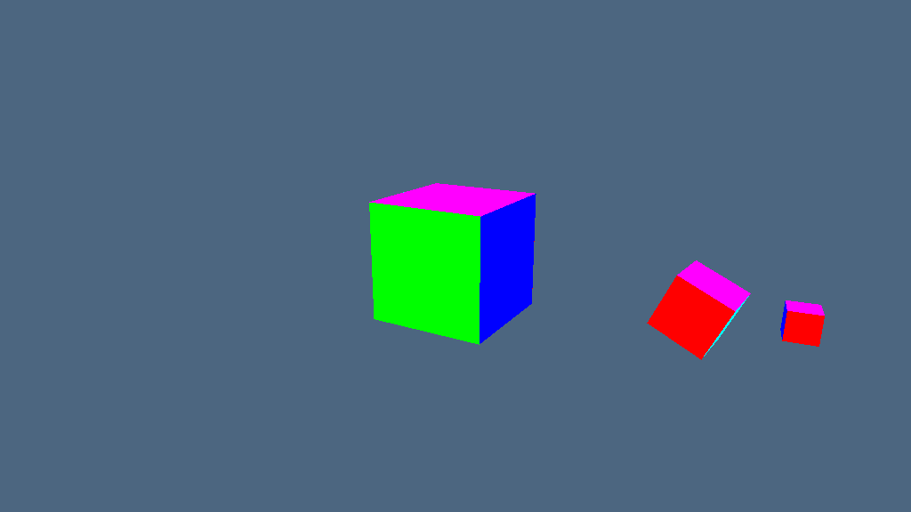
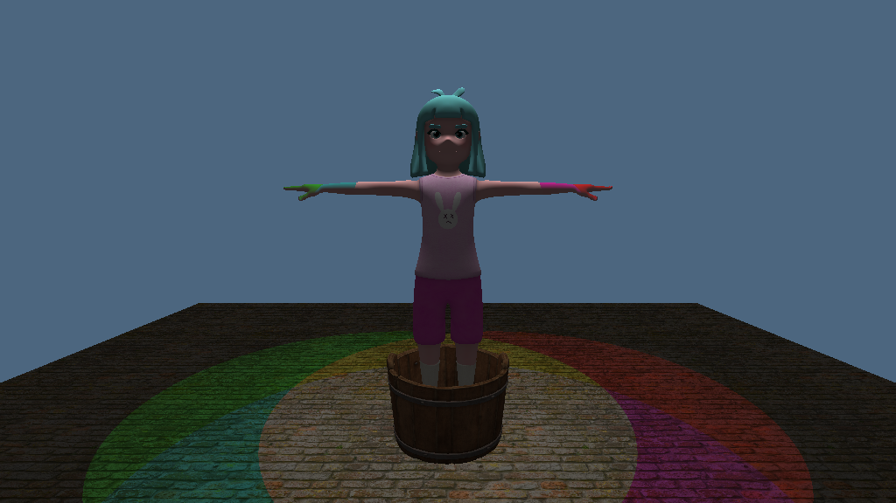
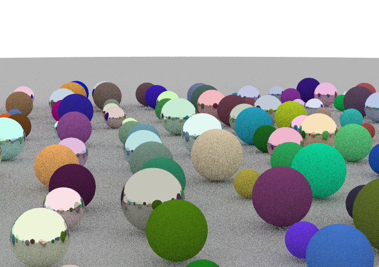

# Computer Graphics 3GC3
### Overview
Assignments for McMaster Software Engineering 3GC3: Computer Graphics. The assignments include some tweaks and features from messing around with OpenGL.

### Table of Contents
- [Assignment 1: Solar System Simulation](#assignment-1-solar-system-simulation)
- [Assignment 3: Amy and the Bucket are at a Disco](#assignment-3-amy-and-the-bucket-are-at-a-disco)

---

## Assignment 1: Solar System Simulation 
> Topics: Shaders, transformations, buffers, graphics pipeline

Small 3-body planetary simulation of cubes orbiting each other. 

Tweaks:
- Added ability to move camera around using wasdqe
- Added hotkeys for switching focus between sun/earth/moon (1, 2, 3)
- Plan to add:
  - time multiplier adjustment on some other keys

---

## Assignment 3: Amy and the Bucket are at a Disco
> Topics: Model loading, Blinn-Phong lighting, texture mapping

A dynamic scene with a few loaded .obj models highlighted with rotating spotlights

---

## Assignment 4: Raytracing Demo
> Topics: Raytracing

Raytracing randomly generated spheres above a floor (modeled as a really big sphere). Includes specular and diffuse reflection.
